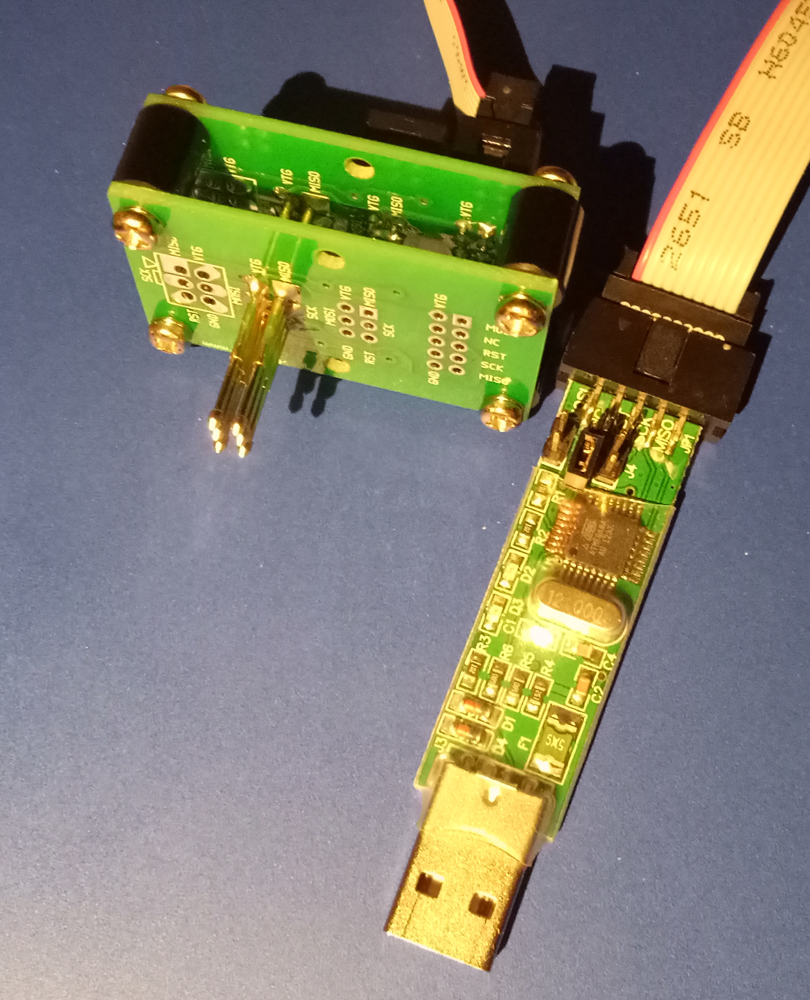

Design files for a pogo pin fixture allowing mirrored or normal ICSP connections, and providing both 6 pin and 10 pin programming cable connections.

The design was created in pcb-rnd, the open source PCB editor ( repo.hu/projects/pcb-rnd )

The design is licenced under the TAPR open hardware licence.

The design assumes 1.3mm diameter pogo pins are being used.

